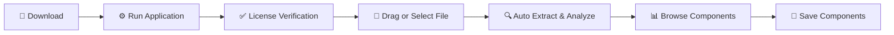

<div align="center">

#  TDev Ultimate Office Toolkit 2026 

### 🔍 VBA Explorer & Macro Extraction Suite 🔍

#### *Extract. Analyze. Export. Remove.*

<p>
  
  
  
  
</p>

<p>
  
  
  
  
  
</p>

---

### ✨ *Extract VBA Code from ANY Office File in Seconds* ✨

</div>

---

<div align="center">
  
  <a href="#arabic"></a>&nbsp;&nbsp;&nbsp;
  <a href="#english"></a>
  
</div>

---

<!-- ======================== ARABIC SECTION ======================== -->
<div id="arabic" dir="rtl">

# <div align="center">🇸🇦 العربية</div>

<div align="center">
  
  
  
  <br><br>
  
  <h2>⚡ أقوى أداة لاستخراج وتحليل أكواد VBA من ملفات الأوفيس ⚡</h2>
  
  <p>
    
  </p>
  
</div>

---

## 📋 المحتويات

<table dir="rtl">
  <tr>
    <td align="center"><a href="#overview-ar">📌 نظرة عامة</a></td>
    <td align="center"><a href="#features-ar">✨ المميزات</a></td>
    <td align="center"><a href="#download-ar">📥 التحميل</a></td>
    <td align="center"><a href="#usage-ar">🚀 الاستخدام</a></td>
   </tr>
   <tr>
    <td align="center"><a href="#formats-ar">🎛️ الصيغ المدعومة</a></td>
    <td align="center"><a href="#extraction-ar">📂 أنواع الاستخراج</a></td>
    <td align="center"><a href="#comparison-ar">📊 مقارنة</a></td>
    <td align="center"><a href="#disclaimer-ar">⚠️ إخلاء مسؤولية</a></td>
   </tr>
</table>

---

<div id="overview-ar"></div>

## 📌 نظرة عامة

<div style="background: linear-gradient(135deg, #1a1a2e 0%, #16213e 100%); padding: 25px; border-radius: 15px; border-right: 5px solid #4CAF50;">

**TDev Ultimate Office Toolkit 2026 - VBA Explorer** هو الحل المتكامل لاستكشاف واستخراج وتحليل أكواد VBA من جميع ملفات **Microsoft Office**.

✨ **ماذا يميزنا؟**

| 🔥 الميزة | 📝 التفاصيل |
|-----------|-------------|
| **كل شيء في أداة واحدة** | Excel + Word + PowerPoint + Access + Outlook + Project + Visio |
| **معالجة محلية 100%** | خصوصية تامة - لا رفع ملفات للإنترنت |
| **دعم الملفات القديمة** | .xls, .doc, .ppt, .mdb |
| **تصنيف ذكي للمكونات** | شيتات، وحدات، كلاسات، نماذج |
| **معالجة مجمعة** | تعامل مع ملفات متعددة بسهولة |
| **سحب وإفلات** | واجهة سهلة وبديهية |
| **تمييز ألوان الكود** | عرض الكود بألوان احترافية |

</div>

---

<div id="features-ar"></div>

## ✨ المميزات الرئيسية

<div align="center">

| 🏆 | الميزة | الوصف |
|:--:|--------|-------|
| 📂 | **استخراج جميع المكونات** | استخراج كل وحدات VBA من الملف |
| 🎨 | **تمييز ألوان الكود** | عرض الكود بألوان مبرمجة ليسهل قراءته |
| 🌳 | **تصنيف ذكي** | تصنيف تلقائي للشيتات والوحدات والكلاسات والنماذج |
| 💾 | **حفظ فردي** | حفظ أي مكون برمجي على حدة |
| 📁 | **حفظ جماعي** | حفظ جميع المكونات في مجلدات مصنفة |
| 🔧 | **حفظ vbaProject.bin** | استخراج ملف المشروع الثنائي كاملاً |
| 🗑️ | **حذف VBA** | إنشاء نسخة جديدة من الملف بدون أكواد VBA |
| 🖱️ | **السحب والإفلات** | اسحب ملفات Office مباشرة إلى الواجهة |

</div>

---

<div id="download-ar"></div>

## 📥 التحميل المباشر

<div align="center">

### ⚡ نسخة جاهزة للتشغيل (Portable)

| الإصدار | الحجم | التحميل |
|---------|-------|---------|
| **TDev Ultimate Office Toolkit 2026** (عربي/إنجليزي) | ~35 MB | [](https://www.up-4ever.net/atefv7ninxbd) |

</div>

<div style="background: #2c3e50; padding: 15px; border-radius: 10px; text-align: center;">
  💡 <strong>ملاحظة:</strong> فقط حمل وشغل مباشرة! لا يحتاج إلى تثبيت. يعمل على Windows 7/8/10/11.
</div>

---

<div id="usage-ar"></div>

## 🚀 طريقة الاستخدام

<div align="center">


</div>

**خطوات بسيطة:**

1. **📥 التحميل:** حمل البرنامج من الرابط أعلاه
2. **▶️ التشغيل:** افتح الملف (لا يحتاج تثبيت)
3. **✅ التحقق:** يتم التحقق من الترخيص عبر الإنترنت (مرة واحدة)
4. **📂 الإضافة:** اسحب ملف Office أو انقر على منطقة السحب
5. **🔍 الاستخراج:** البرنامج يستخرج جميع أكواد VBA تلقائياً
6. **📊 التصفح:** استعرض المكونات في الشجرة الجانبية
7. **💾 الحفظ:** اختر حفظ فردي أو حفظ الكل

---

<div id="formats-ar"></div>

## 🎛️ الصيغ المدعومة

<div align="center">

### 📊 Microsoft Excel

| الصيغة | الامتداد | استخراج VBA | حفظ vbaProject.bin | حذف VBA |
|--------|----------|-------------|--------------------|---------|
| Excel Workbook | .xlsx | ❌ | ❌ | ❌ |
| Macro-Enabled | .xlsm | ✅ | ✅ | ✅ |
| Excel Binary | .xlsb | ✅ | ✅ | ✅ |
| Excel Add-In | .xlam | ✅ | ✅ | ✅ |
| Excel 97-2003 | .xls | ✅ | ✅ | ✅ |
| Template | .xltx/.xltm | ✅ | ✅ | ✅ |

### 📝 Microsoft Word

| الصيغة | الامتداد | استخراج VBA | حفظ vbaProject.bin | حذف VBA |
|--------|----------|-------------|--------------------|---------|
| Word Document | .docx | ❌ | ❌ | ❌ |
| Macro-Enabled | .docm | ✅ | ✅ | ✅ |
| Word 97-2003 | .doc | ✅ | ✅ | ✅ |
| Template | .dotx/.dotm | ✅ | ✅ | ✅ |

### 📽️ Microsoft PowerPoint

| الصيغة | الامتداد | استخراج VBA | حفظ vbaProject.bin | حذف VBA |
|--------|----------|-------------|--------------------|---------|
| Presentation | .pptx | ❌ | ❌ | ❌ |
| Macro-Enabled | .pptm | ✅ | ✅ | ✅ |
| PowerPoint 97-2003 | .ppt | ✅ | ✅ | ✅ |
| Show | .ppsx/.ppsm | ✅ | ✅ | ✅ |

### 🗄️ Microsoft Access

| الصيغة | الامتداد | استخراج VBA | حفظ vbaProject.bin | حذف VBA |
|--------|----------|-------------|--------------------|---------|
| Access Database | .accdb | ✅ | ✅ | ✅ |
| Access Execute | .accde | ✅ | ❌ | ❌ |
| Access 97-2003 | .mdb | ✅ | ✅ | ✅ |

### 📧 Microsoft Outlook & Other

| الصيغة | الامتداد | استخراج VBA |
|--------|----------|-------------|
| Outlook Data | .ost/.pst | ✅ |
| Project | .mpp | ✅ |
| Visio | .vsd | ✅ |
| Publisher | .pub | ✅ |

</div>

---

<div id="extraction-ar"></div>

## 📂 أنواع المكونات المستخرجة

<details>
<summary><b>📊 مكونات Excel VBA</b></summary>

- ✅ وحدات برمجية (Modules) - .bas
- ✅ كلاسات (Class Modules) - .cls
- ✅ شيتات الأوراق (Worksheets) - .cls
- ✅ نماذج المستخدم (UserForms) - .frm
- ✅ ملف ThisWorkbook
- ✅ كافة مكونات VBA الأخرى

</details>

<details>
<summary><b>📝 مكونات Word VBA</b></summary>

- ✅ وحدات برمجية (Modules) - .bas
- ✅ كلاسات المستند (Document Classes) - .cls
- ✅ نماذج المستخدم (UserForms) - .frm
- ✅ كافة مكونات VBA الأخرى

</details>

<details>
<summary><b>📽️ مكونات PowerPoint VBA</b></summary>

- ✅ وحدات برمجية (Modules) - .bas
- ✅ كلاسات العرض (Presentation Classes) - .cls
- ✅ نماذج المستخدم (UserForms) - .frm
- ✅ كافة مكونات VBA الأخرى

</details>

<details>
<summary><b>🗄️ مكونات Access VBA</b></summary>

- ✅ وحدات برمجية (Modules) - .bas
- ✅ كلاسات (Class Modules) - .cls
- ✅ نماذج (Forms) - .frm
- ✅ تقارير (Reports) - .cls
- ✅ كافة مكونات VBA الأخرى

</details>

---

<div id="comparison-ar"></div>

## 📊 مقارنة مع أدوات أخرى

<div align="center">

| الميزة | 🚀 أداتنا | 🏢 أدوات تجارية | 🌐 أدوات أونلاين |
|--------|-----------|-----------------|------------------|
| مجاني 100% | ✅ | ❌ | ❌ |
| Excel + Word + PPT + Access + Outlook | ✅ | ❌ | ❌ |
| تمييز ألوان الكود | ✅ | ✅ | ❌ |
| حفظ مجلدات مصنفة | ✅ | ❌ | ❌ |
| حذف VBA من الملف | ✅ | ❌ | ❌ |
| حفظ vbaProject.bin | ✅ | ✅ | ❌ |
| خصوصية تامة (محلي) | ✅ | ✅ | ❌ |
| دعم عربي | ✅ | ❌ | ❌ |
| سحب وإفلات | ✅ | ❌ | ❌ |
| بدون تثبيت | ✅ | ❌ | ❌ |

</div>

---

## 📁 هيكل الحفظ الجماعي

عند استخدام حفظ الكل، يتم إنشاء الهيكل التالي:

```text
[اسم الملف]/
├── All/                          # جميع المكونات في مجلد واحد
├── Microsoft Excel Objects_sheets/  # الشيتات والأوراق
├── Modules/                      # الوحدات البرمجية (.bas)
├── Class Modules/                # الكلاسات (.cls)
└── Forms_UserForms/              # النماذج (.frm)
```

---

<div id="disclaimer-ar"></div>

## ⚠️ إخلاء مسؤولية

<div style="background: #331f00; padding: 20px; border-radius: 12px; border-right: 5px solid #ffaa00;">

### 🔴 تنبيه مهم جداً

هذه الأداة مخصصة للاستخدام القانوني فقط على:

- 📁 الملفات التي تملكها أنت شخصياً
- 📝 الملفات التي لديك إذن صريح بتعديلها
- 🔬 التحليل الأمني والتعليمي

<details>
<summary><b>باستخدام هذه الأداة، فإنك تقر وتوافق على:</b></summary>

- ✅ أن تتحمل المسؤولية الكاملة عن استخدامها
- ✅ أنك لن تستخدمها على ملفات لا تملكها أو بدون ترخيص
- ✅ أن المطور غير مسؤول عن أي استخدام غير قانوني

</details>

**⚠️ براءة ذمة:** نتبرأ من أي استخدام غير مشروع لهذه الأداة. من استخدمها على ملفات لا يملكها أو بدون ترخيص، فإثمه على نفسه.

</div>

---

## 🤝 المساهمة

نرحب بمساهماتكم! 🎉

| طريقة المساهمة | الوصف |
|----------------|-------|
| 🐛 الإبلاغ عن مشكلة | افتح Issue إذا وجدت خطأ |
| 💡 اقتراح ميزة | شاركنا أفكارك لتحسين الأداة |
| 💻 تطوير الكود | أرسل Pull Request بتحسيناتك |
| 📢 مشاركة الأداة | شارك المشروع مع من قد يستفيد |

---

</div>

<!-- ======================== ENGLISH SECTION ======================== -->
<div id="english" dir="ltr">

# <div align="center">🇬🇧 English</div>

<div align="center">
  
  
  
  <br><br>
  
  <h2>⚡ The Ultimate Tool for VBA Extraction & Analysis from Office Files ⚡</h2>
  
  <p>
    
  </p>
  
</div>

---

## 📋 Table of Contents

| Section | Description |
|---------|-------------|
| <a href="#overview-en">📌 Overview</a> | What is this tool? |
| <a href="#features-en">✨ Features</a> | Key capabilities |
| <a href="#download-en">📥 Download</a> | Get the tool |
| <a href="#usage-en">🚀 Usage</a> | How to use |
| <a href="#formats-en">🎛️ Supported Formats</a> | All Office formats |
| <a href="#extraction-en">📂 Extraction Types</a> | What can be extracted |
| <a href="#comparison-en">📊 Comparison</a> | vs other tools |
| <a href="#disclaimer-en">⚠️ Disclaimer</a> | Legal notice |

---

<div id="overview-en"></div>

## 📌 Overview

<div style="background: linear-gradient(135deg, #1a1a2e 0%, #16213e 100%); padding: 25px; border-radius: 15px; border-left: 5px solid #4CAF50;">

**TDev Ultimate Office Toolkit 2026 - VBA Explorer** is the complete solution for exploring, extracting, and analyzing VBA code from all Microsoft Office files.

**✨ What Makes Us Special?**

| 🔥 Feature | 📝 Details |
|------------|-------------|
| **All-in-One** | Excel + Word + PowerPoint + Access + Outlook + Project + Visio |
| **100% Local Processing** | Full privacy - no files uploaded |
| **Legacy File Support** | .xls, .doc, .ppt, .mdb |
| **Smart Component Classification** | Sheets, Modules, Classes, Forms |
| **Batch Processing** | Handle multiple files easily |
| **Drag & Drop** | Intuitive and easy-to-use interface |
| **Syntax Highlighting** | Professional code coloring |

</div>

---

<div id="features-en"></div>

## ✨ Key Features

<div align="center">

| 🏆 | Feature | Description |
|:--:|---------|-------------|
| 📂 | **Full Component Extraction** | Extract all VBA modules from any file |
| 🎨 | **Syntax Highlighting** | Professional VBA code coloring |
| 🌳 | **Smart Classification** | Automatic classification of sheets, modules, classes, forms |
| 💾 | **Individual Save** | Save any component separately |
| 📁 | **Batch Save** | Save all components in organized folders |
| 🔧 | **Save vbaProject.bin** | Extract the complete binary project file |
| 🗑️ | **Delete VBA** | Create a new file copy without VBA code |
| 🖱️ | **Drag & Drop** | Drag Office files directly into the interface |

</div>

---

<div id="download-en"></div>

## 📥 Direct Download

<div align="center">

### ⚡ Ready-to-run (Portable)

| Version | Size | Download |
|---------|------|----------|
| **TDev Ultimate Office Toolkit 2026** (Arabic/English) | ~35 MB | [](https://www.up-4ever.net/atefv7ninxbd) |

</div>

<div style="background: #2c3e50; padding: 15px; border-radius: 10px; text-align: center;">
  💡 <strong>Note:</strong> Just download and run! No installation required. Works on Windows 7/8/10/11.
</div>

---

<div id="usage-en"></div>

## 🚀 How to Use

<div align="center">



</div>

**Simple Steps:**

1. **📥 Download:** Get the tool from the link above
2. **▶️ Run:** Open the file (no installation needed)
3. **✅ Verify:** One-time online license check
4. **📂 Add:** Drag an Office file or click the drop zone
5. **🔍 Extract:** Tool automatically extracts all VBA code
6. **📊 Browse:** Explore components in the tree view
7. **💾 Save:** Choose individual save or save all

---

<div id="formats-en"></div>

## 🎛️ Supported Formats

<div align="center">

### 📊 Microsoft Excel

| Format | Extension | Extract VBA | Save vbaProject.bin | Delete VBA |
|--------|-----------|-------------|--------------------|-------------|
| Excel Workbook | .xlsx | ❌ | ❌ | ❌ |
| Macro-Enabled | .xlsm | ✅ | ✅ | ✅ |
| Excel Binary | .xlsb | ✅ | ✅ | ✅ |
| Excel Add-In | .xlam | ✅ | ✅ | ✅ |
| Excel 97-2003 | .xls | ✅ | ✅ | ✅ |
| Template | .xltx/.xltm | ✅ | ✅ | ✅ |

### 📝 Microsoft Word

| Format | Extension | Extract VBA | Save vbaProject.bin | Delete VBA |
|--------|-----------|-------------|--------------------|-------------|
| Word Document | .docx | ❌ | ❌ | ❌ |
| Macro-Enabled | .docm | ✅ | ✅ | ✅ |
| Word 97-2003 | .doc | ✅ | ✅ | ✅ |
| Template | .dotx/.dotm | ✅ | ✅ | ✅ |

### 📽️ Microsoft PowerPoint

| Format | Extension | Extract VBA | Save vbaProject.bin | Delete VBA |
|--------|-----------|-------------|--------------------|-------------|
| Presentation | .pptx | ❌ | ❌ | ❌ |
| Macro-Enabled | .pptm | ✅ | ✅ | ✅ |
| PowerPoint 97-2003 | .ppt | ✅ | ✅ | ✅ |
| Show | .ppsx/.ppsm | ✅ | ✅ | ✅ |

### 🗄️ Microsoft Access

| Format | Extension | Extract VBA | Save vbaProject.bin | Delete VBA |
|--------|-----------|-------------|--------------------|-------------|
| Access Database | .accdb | ✅ | ✅ | ✅ |
| Access Execute | .accde | ✅ | ❌ | ❌ |
| Access 97-2003 | .mdb | ✅ | ✅ | ✅ |

### 📧 Microsoft Outlook & Other

| Format | Extension | Extract VBA |
|--------|-----------|-------------|
| Outlook Data | .ost/.pst | ✅ |
| Project | .mpp | ✅ |
| Visio | .vsd | ✅ |
| Publisher | .pub | ✅ |

</div>

---

<div id="extraction-en"></div>

## 📂 Extracted Component Types

<details>
<summary><b>📊 Excel VBA Components</b></summary>

- ✅ Modules - .bas
- ✅ Class Modules - .cls
- ✅ Worksheets - .cls
- ✅ UserForms - .frm
- ✅ ThisWorkbook
- ✅ All other VBA components

</details>

<details>
<summary><b>📝 Word VBA Components</b></summary>

- ✅ Modules - .bas
- ✅ Document Classes - .cls
- ✅ UserForms - .frm
- ✅ All other VBA components

</details>

<details>
<summary><b>📽️ PowerPoint VBA Components</b></summary>

- ✅ Modules - .bas
- ✅ Presentation Classes - .cls
- ✅ UserForms - .frm
- ✅ All other VBA components

</details>

<details>
<summary><b>🗄️ Access VBA Components</b></summary>

- ✅ Modules - .bas
- ✅ Class Modules - .cls
- ✅ Forms - .frm
- ✅ Reports - .cls
- ✅ All other VBA components

</details>

---

<div id="comparison-en"></div>

## 📊 Comparison with Other Tools

<div align="center">

| Feature | 🚀 Our Tool | 🏢 Commercial | 🌐 Online |
|---------|-------------|---------------|-----------|
| 100% Free | ✅ | ❌ | ❌ |
| Excel + Word + PPT + Access + Outlook | ✅ | ❌ | ❌ |
| Syntax Highlighting | ✅ | ✅ | ❌ |
| Organized Folder Save | ✅ | ❌ | ❌ |
| Delete VBA from File | ✅ | ❌ | ❌ |
| Save vbaProject.bin | ✅ | ✅ | ❌ |
| Full Privacy (Local) | ✅ | ✅ | ❌ |
| Arabic Support | ✅ | ❌ | ❌ |
| Drag & Drop | ✅ | ❌ | ❌ |
| No Installation | ✅ | ❌ | ❌ |

</div>

---

## 📁 Batch Save Structure

When using Save All, the following structure is created:

```text
[filename]/
├── All/                          # All components in one folder
├── Microsoft Excel Objects_sheets/  # Worksheets and sheets
├── Modules/                      # Code modules (.bas)
├── Class Modules/                # Class modules (.cls)
└── Forms_UserForms/              # Forms (.frm)
```

---

<div id="disclaimer-en"></div>

## ⚠️ Disclaimer

<div style="background: #1a1a2e; padding: 20px; border-radius: 12px; border-left: 5px solid #ffaa00;">

### 🔴 Important Notice

This tool is intended for legal use only on:

- 📁 Files that you personally own
- 📝 Files for which you have explicit permission to modify
- 🔬 Security analysis and educational purposes

<details>
<summary><b>By using this tool, you acknowledge and agree to:</b></summary>

- ✅ Assume full responsibility for your use of the tool
- ✅ Not use it on files you don't own or without permission
- ✅ The developer is not responsible for any illegal use

</details>

**⚠️ Disclaimer:** We disclaim any responsibility for illegal use of this tool. Anyone who uses it on files they do not own or without permission bears the sole responsibility.

</div>

---

## 🤝 Contributing

We welcome your contributions! 🎉

| Contribution Method | Description |
|--------------------|-------------|
| 🐛 Report an Issue | Open an Issue if you find a bug |
| 💡 Suggest a Feature | Share your ideas to improve the tool |
| 💻 Code Development | Submit a Pull Request with improvements |
| 📢 Share the Tool | Share the project with others who might benefit |

---

</div>
```
